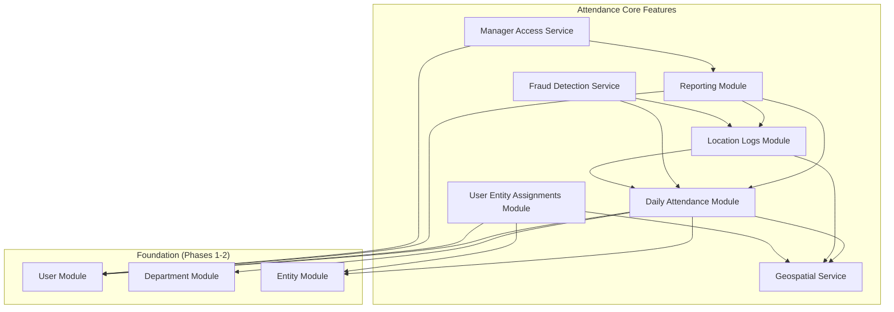
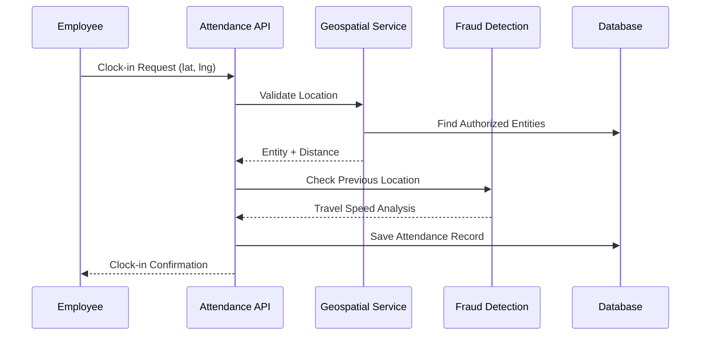
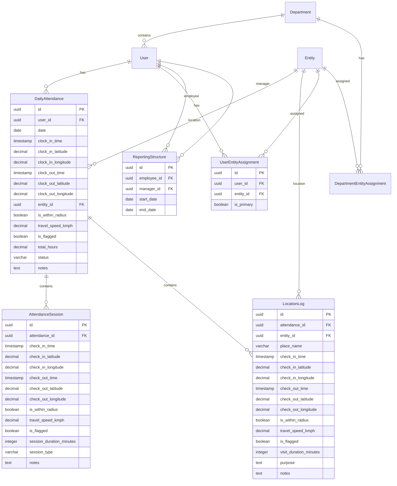
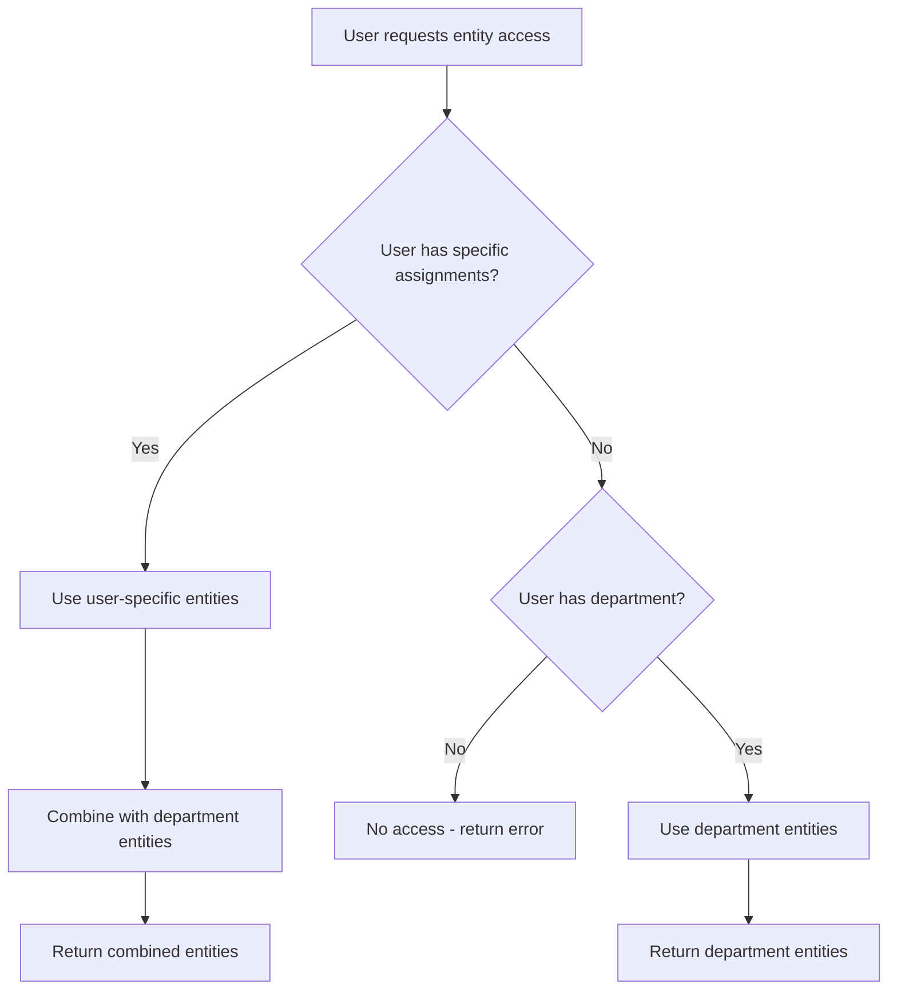

# Design Document

## Overview

This design document outlines the implementation of core attendance functionality for phases 3-6 of the attendance microservice. Building upon the existing foundation of users, departments, and entities, this design introduces daily attendance tracking, field worker location logging, user-specific entity assignments, and comprehensive reporting capabilities.

The system leverages PostGIS for geospatial calculations, implements fraud detection through travel speed analysis, and provides hierarchical access control through both department-based and user-specific entity assignments.

## Architecture

### High-Level Architecture



### Data Flow Architecture



## Components and Interfaces

### 1. Daily Attendance Module

#### Entities

**DailyAttendance Entity**
```typescript
@Entity('daily_attendance')
export class DailyAttendance extends BaseEntity {
  @Column({ type: 'uuid' })
  userId: string;

  @Column({ type: 'date' })
  date: Date;

  @Column({ type: 'timestamp with time zone', nullable: true })
  clockInTime?: Date;

  @Column({ type: 'decimal', precision: 10, scale: 8, nullable: true })
  clockInLatitude?: number;

  @Column({ type: 'decimal', precision: 11, scale: 8, nullable: true })
  clockInLongitude?: number;

  @Column({ type: 'timestamp with time zone', nullable: true })
  clockOutTime?: Date;

  @Column({ type: 'decimal', precision: 10, scale: 8, nullable: true })
  clockOutLatitude?: number;

  @Column({ type: 'decimal', precision: 11, scale: 8, nullable: true })
  clockOutLongitude?: number;

  @Column({ type: 'uuid', nullable: true })
  entityId?: string;

  @Column({ type: 'boolean', nullable: true })
  isWithinRadius?: boolean;

  @Column({ type: 'decimal', precision: 6, scale: 2, nullable: true })
  travelSpeedKmph?: number;

  @Column({ type: 'boolean', default: false })
  isFlagged: boolean;

  @Column({ type: 'decimal', precision: 5, scale: 2, nullable: true })
  totalHours?: number;

  @Column({ type: 'varchar', length: 20, default: 'Present' })
  status: string;

  @Column({ type: 'text', nullable: true })
  notes?: string;

  // Relationships
  @ManyToOne(() => User)
  @JoinColumn({ name: 'user_id' })
  user: User;

  @ManyToOne(() => Entity)
  @JoinColumn({ name: 'entity_id' })
  entity: Entity;

  @OneToMany(() => AttendanceSession, (session) => session.attendance)
  attendanceSessions: AttendanceSession[];

  @OneToMany(() => LocationLog, (log) => log.attendance)
  locationLogs: LocationLog[];
}
```

#### DTOs

**ClockInDto**
```typescript
export class ClockInDto {
  @IsNumber()
  @Min(-90)
  @Max(90)
  latitude: number;

  @IsNumber()
  @Min(-180)
  @Max(180)
  longitude: number;

  @IsOptional()
  @IsString()
  @MaxLength(500)
  notes?: string;
}
```

**ClockOutDto**
```typescript
export class ClockOutDto {
  @IsNumber()
  @Min(-90)
  @Max(90)
  latitude: number;

  @IsNumber()
  @Min(-180)
  @Max(180)
  longitude: number;

  @IsOptional()
  @IsString()
  @MaxLength(500)
  notes?: string;
}
```

**SessionCheckInDto**
```typescript
export class SessionCheckInDto {
  @IsNumber()
  @Min(-90)
  @Max(90)
  latitude: number;

  @IsNumber()
  @Min(-180)
  @Max(180)
  longitude: number;

  @IsOptional()
  @IsString()
  @IsIn(['work', 'break', 'lunch', 'meeting', 'errand'])
  sessionType?: string = 'work';

  @IsOptional()
  @IsString()
  @MaxLength(500)
  notes?: string;
}
```

**SessionCheckOutDto**
```typescript
export class SessionCheckOutDto {
  @IsNumber()
  @Min(-90)
  @Max(90)
  latitude: number;

  @IsNumber()
  @Min(-180)
  @Max(180)
  longitude: number;

  @IsOptional()
  @IsString()
  @MaxLength(500)
  notes?: string;
}
```

#### Service Interface

```typescript
export interface AttendanceServiceInterface {
  // Daily attendance (start/end of day)
  clockIn(userId: string, dto: ClockInDto): Promise<DailyAttendance>;
  clockOut(userId: string, dto: ClockOutDto): Promise<DailyAttendance>;
  
  // Session management (breaks, meetings, etc.)
  sessionCheckIn(userId: string, dto: SessionCheckInDto): Promise<AttendanceSession>;
  sessionCheckOut(userId: string, dto: SessionCheckOutDto): Promise<AttendanceSession>;
  
  // Query methods
  getTodayAttendance(userId: string): Promise<DailyAttendance | null>;
  getAttendanceByDate(userId: string, date: Date): Promise<DailyAttendance | null>;
  getUserAttendanceHistory(userId: string, startDate: Date, endDate: Date): Promise<DailyAttendance[]>;
  getCurrentSession(userId: string): Promise<AttendanceSession | null>;
}
```

### 2. Attendance Sessions Module (Break Management)

#### Entities

**AttendanceSession Entity**
```typescript
@Entity('attendance_sessions')
export class AttendanceSession extends BaseEntity {
  @Column({ type: 'uuid' })
  attendanceId: string;

  @Column({ type: 'timestamp with time zone' })
  checkInTime: Date;

  @Column({ type: 'decimal', precision: 10, scale: 8 })
  checkInLatitude: number;

  @Column({ type: 'decimal', precision: 11, scale: 8 })
  checkInLongitude: number;

  @Column({ type: 'timestamp with time zone', nullable: true })
  checkOutTime?: Date;

  @Column({ type: 'decimal', precision: 10, scale: 8, nullable: true })
  checkOutLatitude?: number;

  @Column({ type: 'decimal', precision: 11, scale: 8, nullable: true })
  checkOutLongitude?: number;

  @Column({ type: 'boolean' })
  isWithinRadius: boolean;

  @Column({ type: 'decimal', precision: 6, scale: 2, nullable: true })
  travelSpeedKmph?: number;

  @Column({ type: 'boolean', default: false })
  isFlagged: boolean;

  @Column({ type: 'integer', nullable: true })
  sessionDurationMinutes?: number;

  @Column({ type: 'varchar', length: 50, default: 'work' })
  sessionType: string; // 'work', 'break', 'lunch', 'meeting', 'errand'

  @Column({ type: 'text', nullable: true })
  notes?: string;

  // Relationships
  @ManyToOne(() => DailyAttendance, (attendance) => attendance.attendanceSessions)
  @JoinColumn({ name: 'attendance_id' })
  attendance: DailyAttendance;
}

### 3. Location Logs Module (Field Worker Client Visits)

#### Entities

**LocationLog Entity**
```typescript
@Entity('location_logs')
export class LocationLog extends BaseEntity {
  @Column({ type: 'uuid' })
  attendanceId: string;

  @Column({ type: 'uuid' })
  entityId: string;

  @Column({ type: 'varchar', length: 255 })
  placeName: string;

  @Column({ type: 'timestamp with time zone', nullable: true })
  checkInTime?: Date;

  @Column({ type: 'decimal', precision: 10, scale: 8, nullable: true })
  checkInLatitude?: number;

  @Column({ type: 'decimal', precision: 11, scale: 8, nullable: true })
  checkInLongitude?: number;

  @Column({ type: 'timestamp with time zone', nullable: true })
  checkOutTime?: Date;

  @Column({ type: 'decimal', precision: 10, scale: 8, nullable: true })
  checkOutLatitude?: number;

  @Column({ type: 'decimal', precision: 11, scale: 8, nullable: true })
  checkOutLongitude?: number;

  @Column({ type: 'boolean', nullable: true })
  isWithinRadius?: boolean;

  @Column({ type: 'decimal', precision: 6, scale: 2, nullable: true })
  travelSpeedKmph?: number;

  @Column({ type: 'boolean', default: false })
  isFlagged: boolean;

  @Column({ type: 'integer', nullable: true })
  visitDurationMinutes?: number;

  @Column({ type: 'text', nullable: true })
  purpose?: string;

  @Column({ type: 'text', nullable: true })
  notes?: string;

  // Relationships
  @ManyToOne(() => DailyAttendance, (attendance) => attendance.locationLogs)
  @JoinColumn({ name: 'attendance_id' })
  attendance: DailyAttendance;

  @ManyToOne(() => Entity)
  @JoinColumn({ name: 'entity_id' })
  entity: Entity;
}
```

### 3. User Entity Assignments Module

#### Entities

**UserEntityAssignment Entity**
```typescript
@Entity('user_entity_assignments')
@Unique(['userId', 'entityId'])
export class UserEntityAssignment extends BaseEntity {
  @Column({ type: 'uuid' })
  userId: string;

  @Column({ type: 'uuid' })
  entityId: string;

  @Column({ type: 'boolean', default: false })
  isPrimary: boolean;

  // Relationships
  @ManyToOne(() => User)
  @JoinColumn({ name: 'user_id' })
  user: User;

  @ManyToOne(() => Entity)
  @JoinColumn({ name: 'entity_id' })
  entity: Entity;
}
```

## API Endpoints

### Daily Attendance Endpoints

#### Clock-In
```
POST /api/attendance/clock-in
Content-Type: application/json

Request Body:
{
  "latitude": 27.7172,
  "longitude": 85.3240,
  "notes": "Starting work"
}

Response: 201 Created
{
  "id": "attendance-uuid",
  "userId": "user-uuid",
  "date": "2025-10-05",
  "clockInTime": "2025-10-05T09:00:00Z",
  "isWithinRadius": true,
  "entity": {
    "id": "entity-uuid",
    "name": "ABC Company HQ"
  }
}
```

#### Clock-Out
```
POST /api/attendance/clock-out
Content-Type: application/json

Request Body:
{
  "latitude": 27.7175,
  "longitude": 85.3245
}

Response: 200 OK
{
  "id": "attendance-uuid",
  "clockOutTime": "2025-10-05T17:30:00Z",
  "totalHours": 8.5,
  "travelSpeedKmph": 2.5,
  "isFlagged": false
}
```

### Session Management Endpoints

#### Session Check-In (for breaks, meetings, etc.)
```
POST /api/attendance/session/check-in
Content-Type: application/json

Request Body:
{
  "latitude": 27.7172,
  "longitude": 85.3240,
  "sessionType": "break",
  "notes": "Coffee break"
}

Response: 201 Created
{
  "id": "session-uuid",
  "attendanceId": "attendance-uuid",
  "checkInTime": "2025-10-05T11:00:00Z",
  "sessionType": "break",
  "isWithinRadius": true
}
```

#### Session Check-Out
```
POST /api/attendance/session/check-out
Content-Type: application/json

Request Body:
{
  "latitude": 27.7175,
  "longitude": 85.3245
}

Response: 200 OK
{
  "id": "session-uuid",
  "checkOutTime": "2025-10-05T11:30:00Z",
  "sessionDurationMinutes": 30,
  "travelSpeedKmph": 1.2,
  "isFlagged": false
}
```

### Field Worker Location Endpoints

#### Location Check-In (client visits)
```
POST /api/attendance/location/check-in
Content-Type: application/json

Request Body:
{
  "entityId": "client-entity-uuid",
  "latitude": 27.7200,
  "longitude": 85.3300,
  "purpose": "Client meeting"
}

Response: 201 Created
{
  "id": "location-log-uuid",
  "entity": {
    "name": "Client Site A"
  },
  "checkInTime": "2025-10-05T10:30:00Z",
  "isWithinRadius": true
}
```

### 4. Reporting Structure Module

#### Entities

**ReportingStructure Entity**
```typescript
@Entity('reporting_structure')
export class ReportingStructure extends BaseEntity {
  @Column({ type: 'uuid' })
  employeeId: string;

  @Column({ type: 'uuid' })
  managerId: string;

  @Column({ type: 'date' })
  startDate: Date;

  @Column({ type: 'date', nullable: true })
  endDate?: Date;

  // Relationships
  @ManyToOne(() => User)
  @JoinColumn({ name: 'employee_id' })
  employee: User;

  @ManyToOne(() => User)
  @JoinColumn({ name: 'manager_id' })
  manager: User;
}
```

### 5. Geospatial Service

#### Interface

```typescript
export interface GeospatialServiceInterface {
  calculateDistance(lat1: number, lng1: number, lat2: number, lng2: number): number;
  calculateTravelSpeed(distance: number, timeMinutes: number): number;
  findNearestAuthorizedEntity(userId: string, latitude: number, longitude: number): Promise<EntityDistanceResult>;
  isWithinRadius(entityLat: number, entityLng: number, userLat: number, userLng: number, radiusMeters: number): boolean;
  validateLocationAccess(userId: string, latitude: number, longitude: number): Promise<LocationValidationResult>;
}
```

#### Implementation Details

**Distance Calculation (Haversine Formula)**
```typescript
calculateDistance(lat1: number, lng1: number, lat2: number, lng2: number): number {
  const R = 6371000; // Earth's radius in meters
  const φ1 = lat1 * Math.PI / 180;
  const φ2 = lat2 * Math.PI / 180;
  const Δφ = (lat2 - lat1) * Math.PI / 180;
  const Δλ = (lng2 - lng1) * Math.PI / 180;

  const a = Math.sin(Δφ/2) * Math.sin(Δφ/2) +
          Math.cos(φ1) * Math.cos(φ2) *
          Math.sin(Δλ/2) * Math.sin(Δλ/2);
  const c = 2 * Math.atan2(Math.sqrt(a), Math.sqrt(1-a));

  return R * c; // Distance in meters
}
```

### 6. Fraud Detection Service

#### Interface

```typescript
export interface FraudDetectionServiceInterface {
  analyzeClockInLocation(userId: string, latitude: number, longitude: number): Promise<FraudAnalysisResult>;
  analyzeClockOutTravel(attendanceId: string, latitude: number, longitude: number): Promise<FraudAnalysisResult>;
  analyzeLocationLogTravel(previousLog: LocationLog, currentLat: number, currentLng: number): Promise<FraudAnalysisResult>;
  flagSuspiciousActivity(recordId: string, recordType: 'attendance' | 'location_log', reason: string): Promise<void>;
}
```

#### Fraud Detection Rules

1. **Travel Speed Analysis**: Flag if speed > 200 km/h between consecutive locations
2. **Location Validation**: Reject if outside all authorized entity radii
3. **Time-Distance Correlation**: Flag impossible travel times
4. **Pattern Analysis**: Detect repeated suspicious behavior

## Data Models

### Database Schema Relationships



### Entity Access Resolution Logic



## Error Handling

### Error Types and Responses

1. **Location Validation Errors**
   - `LOCATION_OUT_OF_RANGE`: User location outside all authorized entity radii
   - `NO_AUTHORIZED_ENTITIES`: User has no entities assigned through department or direct assignment
   - `INVALID_COORDINATES`: Provided coordinates are invalid

2. **Attendance State Errors**
   - `ALREADY_CLOCKED_IN`: User already has active attendance for the day
   - `NOT_CLOCKED_IN`: User attempting to clock-out without clock-in
   - `DUPLICATE_ATTENDANCE`: Attempt to create duplicate attendance record

3. **Field Worker Errors**
   - `ACTIVE_CHECK_IN`: User has active location check-in, must check-out first
   - `NO_DAILY_ATTENDANCE`: Field worker must clock-in before location check-ins
   - `INVALID_ENTITY`: Specified entity not found or not accessible

4. **Fraud Detection Errors**
   - `SUSPICIOUS_TRAVEL_SPEED`: Travel speed exceeds threshold
   - `IMPOSSIBLE_LOCATION`: Location change impossible in given timeframe

### Error Response Format

```typescript
export interface ErrorResponse {
  statusCode: number;
  message: string;
  error: string;
  timestamp: string;
  path: string;
  details?: {
    code: string;
    context?: Record<string, any>;
    suggestions?: string[];
  };
}
```

## Testing Strategy

### Unit Testing

1. **Service Layer Tests**
   - Attendance service methods (clock-in/out logic)
   - Geospatial calculations (distance, speed, validation)
   - Fraud detection algorithms
   - Entity access resolution logic

2. **Entity Tests**
   - Validation rules for all DTOs
   - Database constraints and relationships
   - Entity lifecycle methods

### Integration Testing

1. **API Endpoint Tests**
   - Complete clock-in/out workflows
   - Field worker check-in/out scenarios
   - Manager reporting access
   - Error handling scenarios

2. **Database Integration Tests**
   - PostGIS spatial queries
   - Complex relationship queries
   - Transaction handling
   - Concurrent access scenarios

### End-to-End Testing

1. **User Journey Tests**
   - Complete daily attendance workflow
   - Field worker multi-location visits
   - Manager accessing team reports
   - Fraud detection triggering

2. **Performance Tests**
   - Geospatial query performance
   - Large dataset reporting
   - Concurrent user scenarios

### Test Data Strategy

1. **Geospatial Test Data**
   - Known coordinate sets with calculated distances
   - Entity locations with defined radii
   - Travel scenarios with expected speeds

2. **User Scenarios**
   - Regular office workers
   - Field workers with multiple assignments
   - Managers with team hierarchies
   - Users with mixed department/direct assignments

## Security Considerations

### Authentication and Authorization

1. **JWT Token Validation**
   - All endpoints require valid JWT tokens
   - User context extracted from token claims

2. **Role-Based Access Control**
   - Employees can only access their own attendance
   - Managers can access their team's attendance
   - Admins have full system access

3. **Data Privacy**
   - Location data encrypted at rest
   - Audit logging for sensitive operations
   - GDPR compliance for personal data

### Input Validation

1. **Coordinate Validation**
   - Latitude: -90 to 90 degrees
   - Longitude: -180 to 180 degrees
   - Reasonable precision limits

2. **Business Rule Validation**
   - Entity access permissions
   - Time-based constraints
   - Data consistency checks

## Performance Optimization

### Database Optimization

1. **Indexes**
   - Spatial indexes on location columns
   - Composite indexes on user_id + date
   - Foreign key indexes for relationships

2. **Query Optimization**
   - Use PostGIS spatial functions efficiently
   - Implement pagination for large datasets
   - Cache frequently accessed entity data

### Caching Strategy

1. **Entity Data Caching**
   - Cache user's authorized entities
   - Cache entity location data
   - TTL-based cache invalidation

2. **Geospatial Calculations**
   - Cache distance calculations for repeated queries
   - Pre-calculate common entity distances

## Monitoring and Observability

### Metrics

1. **Business Metrics**
   - Daily attendance rates
   - Average clock-in/out times
   - Fraud detection trigger rates
   - Field worker visit patterns

2. **Technical Metrics**
   - API response times
   - Database query performance
   - Geospatial calculation times
   - Error rates by endpoint

### Logging

1. **Audit Logs**
   - All attendance operations
   - Location access attempts
   - Fraud detection triggers
   - Administrative actions

2. **Performance Logs**
   - Slow query identification
   - Geospatial operation timing
   - Cache hit/miss rates