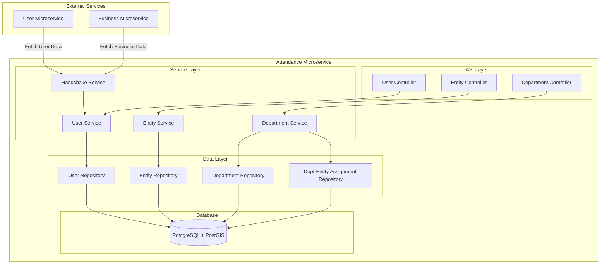
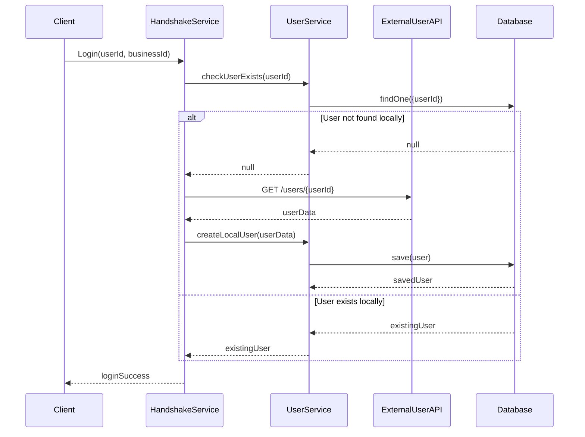

# Design Document - Phase 1 & 2 Foundation

## Overview

The Phase 1 & 2 Foundation implements the core data management and geospatial functionality for the Attendance Microservice. The system follows a handshake-based data population pattern where user and business data is automatically fetched from external microservices during login operations, rather than being created through direct APIs.

The architecture emphasizes simplicity, using NestJS with TypeORM and PostgreSQL with PostGIS extension for geospatial operations. All entities extend a BaseEntity pattern for consistent UUID generation and timestamp management.

## Architecture

### System Architecture



### Data Flow - Handshake Process



## Components and Interfaces

### BaseEntity Pattern

All entities extend a common BaseEntity to ensure consistent structure:

```typescript
@Entity()
export abstract class BaseEntity {
  @PrimaryGeneratedColumn('uuid')
  id: string;

  @CreateDateColumn({ type: 'timestamp with time zone' })
  createdAt: Date;

  @UpdateDateColumn({ type: 'timestamp with time zone' })
  updatedAt: Date;
}
```

### Core Entities

#### User Entity
```typescript
@Entity('users')
export class User extends BaseEntity {
  @Column({ type: 'varchar', length: 255 })
  name: string;

  @Column({ type: 'varchar', length: 20, unique: true })
  phone: string;

  @Column({ type: 'varchar', length: 255, unique: true })
  email: string;

  @Column({ type: 'text', nullable: true })
  address: string;

  @Column({ type: 'varchar', length: 255, nullable: true })
  userId: string; // External microservice ID

  @Column({ type: 'boolean', default: false })
  isFieldWorker: boolean;

  @Column({ type: 'uuid', nullable: true })
  departmentId: string;

  @ManyToOne(() => Department, { nullable: true })
  @JoinColumn({ name: 'department_id' })
  department: Department;

  @Column({ type: 'timestamp with time zone', nullable: true })
  lastSyncedAt: Date;
}
```

#### Department Entity
```typescript
@Entity('departments')
export class Department extends BaseEntity {
  @Column({ type: 'varchar', length: 100, unique: true })
  name: string;

  @Column({ type: 'uuid' })
  businessId: string;

  @OneToMany(() => User, user => user.department)
  users: User[];

  @OneToMany(() => DepartmentEntityAssignment, assignment => assignment.department)
  entityAssignments: DepartmentEntityAssignment[];
}
```

#### Entity (Business Location)
```typescript
@Entity('entities')
export class Entity extends BaseEntity {
  @Column({ type: 'varchar', length: 255 })
  name: string;

  @Column({ type: 'varchar', length: 100, unique: true })
  kahaId: string;

  @Column({ type: 'varchar', length: 12 })
  geohash: string;

  @Column({ type: 'text', nullable: true })
  address: string;

  @Column({
    type: 'geography',
    spatialFeatureType: 'Point',
    srid: 4326
  })
  location: Point;

  @Column({ type: 'integer', default: 100 })
  radiusMeters: number;

  @Column({ type: 'text', nullable: true })
  avatarUrl: string;

  @Column({ type: 'text', nullable: true })
  coverImageUrl: string;

  @Column({ type: 'text', nullable: true })
  description: string;

  @OneToMany(() => DepartmentEntityAssignment, assignment => assignment.entity)
  departmentAssignments: DepartmentEntityAssignment[];
}
```

#### Department-Entity Assignment
```typescript
@Entity('department_entity_assignments')
export class DepartmentEntityAssignment extends BaseEntity {
  @Column({ type: 'uuid' })
  departmentId: string;

  @Column({ type: 'uuid' })
  entityId: string;

  @Column({ type: 'boolean', default: false })
  isPrimary: boolean;

  @ManyToOne(() => Department, department => department.entityAssignments)
  @JoinColumn({ name: 'department_id' })
  department: Department;

  @ManyToOne(() => Entity, entity => entity.departmentAssignments)
  @JoinColumn({ name: 'entity_id' })
  entity: Entity;

  @Unique(['departmentId', 'entityId'])
  uniqueDeptEntity: any;
}
```

### Service Layer Design

#### HandshakeService
Responsible for the automatic data population process:

```typescript
@Injectable()
export class HandshakeService {
  async ensureUserExists(userId: string): Promise<User>
  async ensureBusinessExists(businessId: string): Promise<Business>
  private async fetchUserFromExternal(userId: string): Promise<any>
  private async fetchBusinessFromExternal(businessId: string): Promise<any>
}
```

#### EntityService
Handles geospatial operations and entity management:

```typescript
@Injectable()
export class EntityService {
  async create(dto: CreateEntityDto): Promise<Entity>
  async findNearby(lat: number, lng: number, radius: number): Promise<NearbyEntityDto[]>
  async validateLocationWithinRadius(entityId: string, lat: number, lng: number): Promise<boolean>
  private calculateGeohash(lat: number, lng: number): string
}
```

## Data Models

### Database Schema with PostGIS

```sql
-- Enable PostGIS extension
CREATE EXTENSION IF NOT EXISTS postgis;

-- Departments table
CREATE TABLE departments (
    id UUID PRIMARY KEY DEFAULT gen_random_uuid(),
    name VARCHAR(100) NOT NULL UNIQUE,
    business_id UUID NOT NULL,
    created_at TIMESTAMP WITH TIME ZONE DEFAULT CURRENT_TIMESTAMP,
    updated_at TIMESTAMP WITH TIME ZONE DEFAULT CURRENT_TIMESTAMP
);

-- Users table
CREATE TABLE users (
    id UUID PRIMARY KEY DEFAULT gen_random_uuid(),
    name VARCHAR(255) NOT NULL,
    phone VARCHAR(20) NOT NULL UNIQUE,
    email VARCHAR(255) NOT NULL UNIQUE,
    address TEXT,
    user_id VARCHAR(255), -- External microservice ID
    is_field_worker BOOLEAN DEFAULT FALSE,
    department_id UUID,
    last_synced_at TIMESTAMP WITH TIME ZONE,
    created_at TIMESTAMP WITH TIME ZONE DEFAULT CURRENT_TIMESTAMP,
    updated_at TIMESTAMP WITH TIME ZONE DEFAULT CURRENT_TIMESTAMP,
    CONSTRAINT fk_department FOREIGN KEY (department_id) 
        REFERENCES departments(id) ON DELETE SET NULL
);

-- Entities table with PostGIS
CREATE TABLE entities (
    id UUID PRIMARY KEY DEFAULT gen_random_uuid(),
    name VARCHAR(255) NOT NULL,
    kaha_id VARCHAR(100) NOT NULL UNIQUE,
    geohash VARCHAR(12) NOT NULL,
    address TEXT,
    location GEOGRAPHY(POINT, 4326),
    radius_meters INTEGER NOT NULL DEFAULT 100,
    avatar_url TEXT,
    cover_image_url TEXT,
    description TEXT,
    created_at TIMESTAMP WITH TIME ZONE DEFAULT CURRENT_TIMESTAMP,
    updated_at TIMESTAMP WITH TIME ZONE DEFAULT CURRENT_TIMESTAMP
);

-- Department-Entity assignments
CREATE TABLE department_entity_assignments (
    id UUID PRIMARY KEY DEFAULT gen_random_uuid(),
    department_id UUID NOT NULL,
    entity_id UUID NOT NULL,
    is_primary BOOLEAN DEFAULT FALSE,
    created_at TIMESTAMP WITH TIME ZONE DEFAULT CURRENT_TIMESTAMP,
    updated_at TIMESTAMP WITH TIME ZONE DEFAULT CURRENT_TIMESTAMP,
    CONSTRAINT fk_department FOREIGN KEY (department_id) 
        REFERENCES departments(id) ON DELETE CASCADE,
    CONSTRAINT fk_entity FOREIGN KEY (entity_id) 
        REFERENCES entities(id) ON DELETE CASCADE,
    CONSTRAINT unique_dept_entity UNIQUE (department_id, entity_id)
);

-- Indexes for performance
CREATE INDEX idx_users_department ON users(department_id);
CREATE INDEX idx_users_email ON users(email);
CREATE INDEX idx_users_phone ON users(phone);
CREATE INDEX idx_users_user_id ON users(user_id);
CREATE INDEX idx_entities_kaha_id ON entities(kaha_id);
CREATE INDEX idx_entities_geohash ON entities(geohash);
CREATE INDEX idx_entities_location ON entities USING GIST(location);
CREATE INDEX idx_dept_entity_dept ON department_entity_assignments(department_id);
CREATE INDEX idx_dept_entity_entity ON department_entity_assignments(entity_id);
```

### Geospatial Calculations

The system uses PostGIS for accurate geospatial operations:

1. **Distance Calculation**: `ST_Distance(geography1, geography2)` for spherical distance
2. **Point Creation**: `ST_Point(longitude, latitude)::geography` for location storage
3. **Radius Validation**: `ST_DWithin(location, point, radius)` for proximity checks
4. **Geohash**: Custom implementation for efficient proximity pre-filtering

## Error Handling

### Error Categories

1. **Validation Errors (400)**
   - Invalid coordinates (lat/lng out of range)
   - Invalid radius (not between 10-1000m)
   - Duplicate kahaId or email/phone
   - Missing required fields

2. **Not Found Errors (404)**
   - User not found in external service
   - Entity not found
   - Department not found

3. **Conflict Errors (409)**
   - Duplicate entity assignment
   - Multiple primary entities for department
   - Unique constraint violations

4. **External Service Errors (502/503)**
   - User Microservice unavailable
   - Business Microservice timeout
   - Network connectivity issues

### Error Response Format

```typescript
{
  "statusCode": 400,
  "message": "Validation failed",
  "errors": [
    {
      "field": "latitude",
      "message": "Latitude must be between -90 and 90"
    }
  ],
  "timestamp": "2025-10-05T10:30:00Z"
}
```

## Testing Strategy

### Unit Testing
- Service layer methods with mocked repositories
- Geospatial calculation functions
- Validation logic
- Error handling scenarios

### Integration Testing
- Database operations with test database
- External API calls with mock servers
- End-to-end handshake process
- PostGIS spatial queries

### Test Data Strategy
- Use factory pattern for test data generation
- Separate test database with PostGIS extension
- Mock external microservice responses
- Test with various geographic locations (Nepal, international)

### Key Test Scenarios

1. **Handshake Process**
   - User exists locally → no external call
   - User doesn't exist → fetch and save
   - External service unavailable → proper error handling

2. **Geospatial Operations**
   - Location within radius → validation passes
   - Location outside radius → validation fails
   - Nearby entity search → correct distance calculations
   - Geohash generation → consistent results

3. **Department-Entity Assignments**
   - Single primary entity per department
   - Prevent duplicate assignments
   - Cascade delete handling

### Performance Considerations

1. **Database Indexes**
   - GIST index on location column for spatial queries
   - B-tree indexes on frequently queried columns
   - Composite indexes for common query patterns

2. **Query Optimization**
   - Use geohash for initial proximity filtering
   - Limit spatial queries to reasonable search radius
   - Eager loading for related entities when needed

3. **Caching Strategy**
   - No Redis caching (following process rules)
   - Rely on PostgreSQL query cache
   - Use lastSyncedAt for data freshness validation