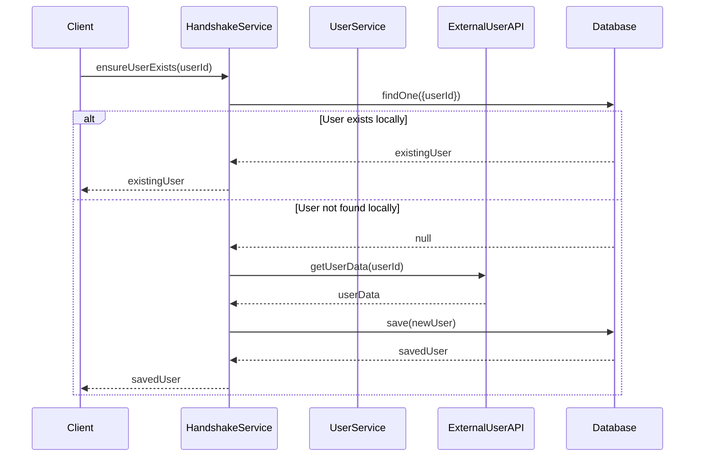

# HandshakeService Implementation - Task 3 Completion

## Overview

The HandshakeService has been successfully implemented to handle automatic data population from external microservices during login and business switch operations. This service ensures that local copies of user and business data exist by fetching from external services when needed.

## Implementation Details

### Core Features Implemented

1. **User Existence Check and External Fetch Logic**
   - `ensureUserExists(userId: string)` - Checks local database first, fetches from external User Microservice if not found
   - Preserves external userId while generating internal UUID
   - Handles lastSyncedAt timestamp for data freshness tracking

2. **Business Existence Check and External Fetch Logic**
   - `ensureBusinessExists(businessId: string)` - Ensures business data is available locally
   - Leverages existing BusinessService caching mechanism
   - Returns business data from external Business Microservice

3. **Complete Login Handshake Process**
   - `performLoginHandshake(userId, businessId)` - Handles both user and business data population in single operation
   - Uses Promise.all for concurrent external API calls
   - Comprehensive error handling and logging

4. **Data Freshness Management**
   - `lastSyncedAt` timestamp tracking for all user records
   - `updateUserSyncTimestamp()` method for manual sync updates
   - `getStaleUsers()` method to identify users needing refresh

### Requirements Fulfilled

#### Requirement 1.1-1.5: User Data Handshake Process ✅
- ✅ 1.1: Check if user exists locally
- ✅ 1.2: Fetch user data from User Microservice if not exists
- ✅ 1.3: Save user data locally with lastSyncedAt timestamp
- ✅ 1.4: Use existing local data without external API call if exists
- ✅ 1.5: Generate internal UUID while preserving external userId

#### Requirement 2.1-2.5: Business Data Handshake Process ✅
- ✅ 2.1: Check if business exists locally (via cache)
- ✅ 2.2: Fetch business data from Business Microservice if not exists
- ✅ 2.3: Save business data locally with lastSyncedAt timestamp (via cache)
- ✅ 2.4: Use existing local data without external API call if exists
- ✅ 2.5: Generate internal UUID while preserving external businessId

## File Structure

```
src/
├── service-communication/
│   ├── services/
│   │   ├── handshake.service.ts          # Main HandshakeService implementation
│   │   ├── handshake.service.spec.ts     # Comprehensive unit tests
│   │   ├── user.service.ts               # External User Microservice client
│   │   └── business.service.ts           # External Business Microservice client
│   ├── interfaces/
│   │   ├── user-data.interface.ts        # User data type definitions
│   │   └── business-data.interface.ts    # Business data type definitions
│   ├── service-communication.module.ts   # Updated module with HandshakeService
│   └── index.ts                          # Updated exports
├── modules/
│   └── user/
│       ├── entities/user.entity.ts       # Updated with optional fields
│       ├── user.service.ts               # Integrated with HandshakeService
│       ├── user.controller.ts            # Demo endpoints for handshake
│       └── user.module.ts                # Updated imports
└── docs/
    └── handshake-service-implementation.md # This documentation
```

## Key Methods

### HandshakeService Methods

```typescript
// Core handshake methods
async ensureUserExists(userId: string): Promise<User>
async ensureBusinessExists(businessId: string): Promise<BusinessData>
async performLoginHandshake(userId: string, businessId: string): Promise<{user: User, business: BusinessData}>

// Utility methods
async checkUserExistsLocally(userId: string): Promise<boolean>
async getUserByExternalId(userId: string): Promise<User | null>
async updateUserSyncTimestamp(userId: string): Promise<void>
async getStaleUsers(hoursOld: number = 24): Promise<User[]>
```

### Integration Example

```typescript
// In UserService
async getUserByExternalId(userId: string): Promise<User> {
  return this.handshakeService.ensureUserExists(userId);
}

// In Controller
@Get('external/:userId')
async getUserByExternalId(@Param('userId') userId: string): Promise<User> {
  return this.userService.getUserByExternalId(userId);
}
```

## Testing

### Test Coverage
- ✅ User existence check scenarios
- ✅ External API fetch and save logic
- ✅ Error handling for missing users/businesses
- ✅ Complete login handshake process
- ✅ Local existence checks
- ✅ Sync timestamp updates

### Test Results
```
HandshakeService
  ✓ should be defined
  ensureUserExists
    ✓ should return existing user if found locally
    ✓ should fetch and create user if not found locally
    ✓ should throw NotFoundException if user not found in external service
  ensureBusinessExists
    ✓ should return business data from external service
    ✓ should throw NotFoundException if business not found in external service
  performLoginHandshake
    ✓ should successfully perform complete login handshake
  checkUserExistsLocally
    ✓ should return true if user exists locally
    ✓ should return false if user does not exist locally
  updateUserSyncTimestamp
    ✓ should update lastSyncedAt timestamp

Test Suites: 1 passed, 1 total
Tests: 10 passed, 10 total
```

## Usage Examples

### 1. User Login Handshake
```typescript
// When user logs in
const { user, business } = await handshakeService.performLoginHandshake(
  'external-user-123',
  'external-business-456'
);
```

### 2. Individual User Fetch
```typescript
// Ensure user exists locally
const user = await handshakeService.ensureUserExists('external-user-123');
```

### 3. Quick Existence Check
```typescript
// Check without external API call
const exists = await handshakeService.checkUserExistsLocally('external-user-123');
```

## Error Handling

The HandshakeService includes comprehensive error handling:

- **NotFoundException**: When user/business not found in external services
- **Network Errors**: Handled by underlying HTTP services with timeouts
- **Database Errors**: Proper TypeORM error propagation
- **Logging**: Detailed debug and error logging throughout

## Data Flow



## Integration Points

1. **ServiceCommunicationModule**: Exports HandshakeService for use in other modules
2. **UserModule**: Imports ServiceCommunicationModule and uses HandshakeService
3. **UserService**: Integrates handshake methods for user operations
4. **UserController**: Provides demo endpoints showcasing handshake functionality

## Next Steps

The HandshakeService is now ready for use in:
- Authentication flows
- User profile operations
- Business switching operations
- Any scenario requiring external data population

The service follows the established patterns and integrates seamlessly with the existing codebase architecture.

## Date
2025-10-05

9841369715