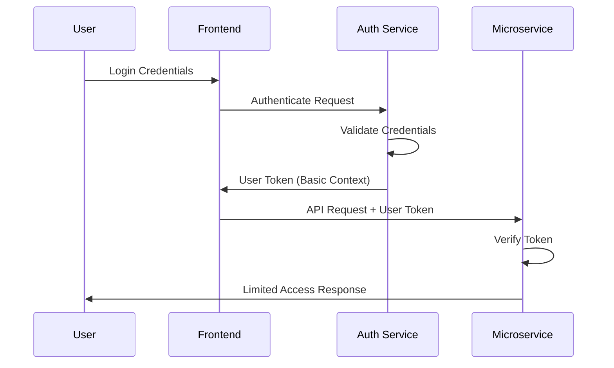
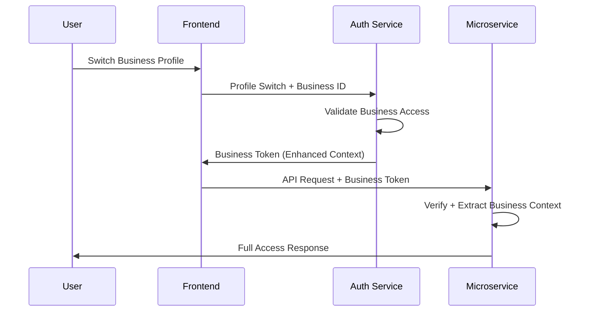

# Authentication System - Theoretical Concepts

## 🎯 Core Authentication Theory

### JWT (JSON Web Token) Based Authentication

Our authentication system is built on JWT tokens, which provide a stateless, scalable authentication mechanism. Here's the theoretical foundation:

#### **Token-Based Authentication Principles**

1. **Stateless Authentication**
   - No server-side session storage required
   - Each request contains all necessary authentication information
   - Horizontally scalable across multiple service instances

2. **Cryptographic Security**
   - Tokens are signed using shared secrets (HMAC) or public/private keys (RSA)
   - Signature verification ensures token integrity and authenticity
   - Prevents token tampering and forgery

3. **Time-Based Expiration**
   - Tokens have built-in expiration times (`exp` claim)
   - Reduces security risk from token compromise
   - Forces periodic re-authentication

## 🏗️ Microservice Authentication Architecture

### **Centralized Authentication with Distributed Verification**

```
┌─────────────────────────────────────────────────────────────────┐
│                    Authentication Theory                        │
│                                                                 │
│  ┌─────────────────┐    ┌─────────────────┐    ┌─────────────┐ │
│  │  Auth Provider  │    │  Token Issuer   │    │   Verifier  │ │
│  │   (Kaha Main)   │───▶│   (JWT Gen)     │───▶│ (Services)  │ │
│  │                 │    │                 │    │             │ │
│  │ - User Auth     │    │ - Sign Tokens   │    │ - Verify    │ │
│  │ - Business Auth │    │ - Set Claims    │    │ - Extract   │ │
│  │ - Profile Switch│    │ - Expiration    │    │ - Validate  │ │
│  └─────────────────┘    └─────────────────┘    └─────────────┘ │
└─────────────────────────────────────────────────────────────────┘
```

### **Key Theoretical Concepts**

#### 1. **Single Sign-On (SSO) Pattern**
- User authenticates once with central authority (Kaha Main)
- Receives token valid across all microservices
- No need to re-authenticate for each service

#### 2. **Context-Aware Authentication**
- **User Context**: Basic user identity and permissions
- **Business Context**: Additional business-specific permissions and data access
- **Progressive Enhancement**: Start with user context, upgrade to business context

#### 3. **Trust Boundary Management**
- **Internal Trust**: Services trust tokens signed by known authority
- **External Verification**: Each service independently verifies token integrity
- **Zero Trust**: No implicit trust between services

## 🔐 Security Model

### **Defense in Depth Strategy**

#### **Layer 1: Token Integrity**
```typescript
// Cryptographic signature verification
const isValid = crypto.verify(token.signature, token.payload, sharedSecret);
```

#### **Layer 2: Temporal Validation**
```typescript
// Time-based security
const isExpired = token.exp < Date.now() / 1000;
const isActive = token.iat <= Date.now() / 1000;
```

#### **Layer 3: Context Validation**
```typescript
// Business context verification
const hasBusinessAccess = token.businessId && validateBusinessAccess(token.businessId, token.id);
```

#### **Layer 4: Authorization Checks**
```typescript
// Resource-level permissions
const canAccess = checkPermissions(token.id, resource, action);
```

### **Threat Mitigation**

| Threat | Mitigation Strategy | Implementation |
|--------|-------------------|----------------|
| **Token Theft** | Short expiration times | `exp` claim validation |
| **Token Replay** | Time-based validation | `iat` and `exp` checks |
| **Token Tampering** | Cryptographic signatures | HMAC/RSA verification |
| **Privilege Escalation** | Context-aware guards | Business context validation |
| **Service Impersonation** | Shared secret security | Secure secret management |

## 🔄 Authentication Flow Theory

### **Multi-Stage Authentication Process**

#### **Stage 1: Initial Authentication**


**Theory**: Principle of least privilege - start with minimal access

#### **Stage 2: Context Enhancement**


**Theory**: Progressive enhancement - add context as needed

### **Token Lifecycle Management**

#### **Token States**
1. **Issued**: Token created and signed by authority
2. **Active**: Token within validity period
3. **Expired**: Token past expiration time
4. **Revoked**: Token explicitly invalidated (future enhancement)

#### **State Transitions**
```
[Issued] ──time──▶ [Active] ──time──▶ [Expired]
    │                  │
    └──revoke──▶ [Revoked] ◀──revoke──┘
```

## 🏛️ Architectural Patterns

### **1. Gateway Pattern**
- Authentication handled at service boundary
- Guards act as gatekeepers for protected resources
- Consistent security policy enforcement

### **2. Decorator Pattern**
- Guards and decorators add authentication behavior
- Non-intrusive security implementation
- Composable security policies

### **3. Strategy Pattern**
- Different guards for different authentication requirements
- Pluggable authentication strategies
- Flexible security configurations

### **4. Observer Pattern**
- Authentication events can trigger additional actions
- Logging, monitoring, and auditing capabilities
- Extensible security event handling

## 📊 Data Flow Theory

### **Authentication Data Flow**

```
┌─────────────┐    ┌─────────────┐    ┌─────────────┐
│   Request   │───▶│    Guard    │───▶│  Controller │
│             │    │             │    │             │
│ - Headers   │    │ - Extract   │    │ - Business  │
│ - Token     │    │ - Verify    │    │   Logic     │
│ - Payload   │    │ - Validate  │    │ - Response  │
└─────────────┘    └─────────────┘    └─────────────┘
                           │
                           ▼
                   ┌─────────────┐
                   │   Context   │
                   │             │
                   │ - User ID   │
                   │ - Business  │
                   │ - Metadata  │
                   └─────────────┘
```

### **Service Communication Theory**

#### **Synchronous Communication Pattern**
- Real-time data fetching from external services
- Immediate consistency for critical operations
- Higher latency but guaranteed fresh data

#### **Caching Strategy**
- **Cache-Aside Pattern**: Check cache first, fetch on miss
- **Time-Based Invalidation**: 10-minute TTL for balance of freshness and performance
- **Bulk Operations**: Reduce API calls through batch processing

#### **Circuit Breaker Theory**
- Fail fast when external services are unavailable
- Graceful degradation using cached data
- Automatic recovery when services return

## 🎭 Role-Based Access Control (RBAC) Theory

### **Hierarchical Permission Model**

```
┌─────────────────────────────────────────────────────────────┐
│                    Permission Hierarchy                     │
│                                                             │
│  ┌─────────────┐    ┌─────────────┐    ┌─────────────┐     │
│  │   System    │───▶│  Business   │───▶│    User     │     │
│  │    Admin    │    │    Admin    │    │   Member    │     │
│  │             │    │             │    │             │     │
│  │ - All Perms │    │ - Bus Perms │    │ - User Perms│     │
│  │ - All Biz   │    │ - Own Biz   │    │ - Own Data  │     │
│  └─────────────┘    └─────────────┘    └─────────────┘     │
└─────────────────────────────────────────────────────────────┘
```

### **Context-Based Permissions**

#### **User Context Permissions**
- Access to own profile data
- Basic system functionality
- Limited cross-business visibility

#### **Business Context Permissions**
- Full access to business data
- Team member management
- Business-specific operations

### **Permission Inheritance Theory**
- Higher-level contexts inherit lower-level permissions
- Business context includes user context capabilities
- Additive permission model (no permission removal)

## 🔬 Performance Theory

### **Caching Strategy Theory**

#### **Cache Hit Optimization**
```
Cache Hit Rate = (Cache Hits) / (Total Requests) × 100%

Target: >90% hit rate for repeated requests
```

#### **Memory vs. Network Trade-off**
- **Memory Cost**: Store frequently accessed data locally
- **Network Cost**: Fetch data from external services
- **Optimal Balance**: 10-minute cache duration

### **Bulk Operation Theory**

#### **Network Efficiency**
```
Individual Requests: N × (Network Latency + Processing Time)
Bulk Request: 1 × (Network Latency + N × Processing Time)

Efficiency Gain = N × Network Latency
```

#### **Batch Processing Benefits**
- Reduced network overhead
- Lower connection establishment costs
- Improved throughput for multiple operations

## 🧠 Cognitive Load Theory

### **Developer Experience Design**

#### **Principle of Least Surprise**
- Consistent naming conventions across guards and services
- Predictable behavior patterns
- Clear error messages and documentation

#### **Progressive Disclosure**
- Start with simple authentication (JwtAuthGuard)
- Add complexity as needed (BusinessAuthGuard)
- Optional features don't complicate basic usage

#### **Cognitive Chunking**
- Related functionality grouped in modules
- Clear separation of concerns
- Intuitive API design

### **Mental Model Alignment**

#### **Guard Selection Logic**
```
Need Authentication? ──No──▶ No Guard
        │
       Yes
        │
        ▼
Need Business Context? ──No──▶ JwtAuthGuard
        │
       Yes
        │
        ▼
    BusinessAuthGuard
```

#### **Service Communication Logic**
```
Need External Data? ──No──▶ Use Local Data
        │
       Yes
        │
        ▼
Single or Multiple? ──Single──▶ getXData()
        │
    Multiple
        │
        ▼
    getBulkXData()
```

## 🔮 Future Theoretical Considerations

### **Scalability Theory**
- **Horizontal Scaling**: Stateless tokens enable easy service replication
- **Load Distribution**: No session affinity requirements
- **Cache Partitioning**: Distributed caching for large-scale deployments

### **Security Evolution**
- **Token Rotation**: Implement refresh token patterns
- **Fine-Grained Permissions**: Resource-level access control
- **Audit Trails**: Comprehensive security event logging

### **Performance Optimization**
- **Predictive Caching**: Machine learning for cache preloading
- **Adaptive TTL**: Dynamic cache duration based on usage patterns
- **Edge Caching**: Geographically distributed token verification

---

This theoretical foundation ensures that our authentication system is not just functional, but also scalable, secure, and maintainable. The concepts outlined here guide implementation decisions and provide a framework for future enhancements.